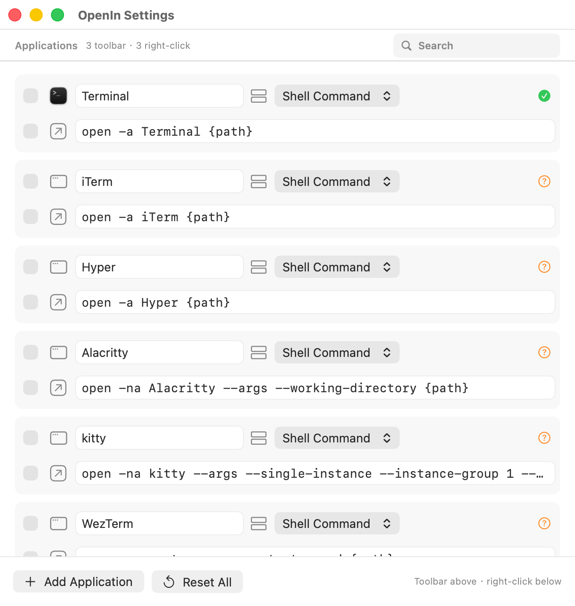

# OpenIn

OpenIn adds a configurable Finder right-click menu and Finder toolbar button for opening the current directory in terminals, editors, or custom applications.

[简体中文](README-zh-CN.md)

<p align="center">
  
</p>

## Features

- Built-in Terminal and Editor list based on OpenInTerminal's supported applications.
- Additionally includes built-in tty7, Otty, Muxy, kooky, herdr, and Rio.
- Neovim opens through Kitty, following OpenInTerminal's supported command.
- Each item has separate checkboxes for Finder's contextual menu and toolbar dropdown.
- Custom applications can use a URL Scheme or Shell Command with `{path}`.
- Built-in applications expose their launch type (Shell Command or URL Scheme) and launch method, with per-item and reset-all controls.
- Shell commands are executed by the host app because Finder Sync extensions are sandboxed.

## Screenshot

<p align="center">
  
</p>

## Native macOS features and scope

OpenIn does not bundle a terminal, editor, or file manager, and it does not replace Finder's native commands. It gathers launchers for applications already installed on your Mac into Finder's first-level menu. The native alternatives are:

- **Copy path** — select an item and press **⌥⌘C**. Holding **⌥** while opening the context menu also reveals **Copy … as Pathname**.
- **Create a new file** — macOS does not currently provide a native Finder command for this, and OpenIn does not add one. Use `touch filename.ext` in a terminal when needed.

## Build and install locally (free self-signing)

Apple's free **Personal Team** can be used for personal development and testing in Xcode, but it is not a Developer ID identity and cannot be used for App Store or enterprise distribution ([Apple](https://developer.apple.com/library/archive/qa/qa1915/)). A paid Apple Developer Program membership is required for Developer ID signing and notarization ([membership comparison](https://developer.apple.com/support/compare-memberships/)).

For local use, OpenIn uses a free ad hoc signature. The repository's [Makefile](Makefile) wraps compilation, signing, extension registration, Finder reload, and packaging:

```bash
make check    # compile, sign, verify, and check the worktree
make install  # install to /Applications and enable the Finder extension
make package  # create a distributable zip
```

The Makefile uses the macOS Command Line Tools and does not require a paid Apple account. If `/Applications` is not writable, use `make install INSTALL_DIR="$HOME/Applications"` or drag `build/manual/Release/OpenIn.app` there in Finder. Ad hoc signing is not notarization; if macOS blocks the first launch, Control-click `OpenIn.app` and choose **Open**, or use **System Settings → Privacy & Security → Open Anyway**.

The settings window shows all supported apps. Installed apps are shown in both Finder menus by default; each menu can be disabled independently. Built-in launch types and launch methods can be edited and reset. Custom applications can use examples such as:

```text
myapp://open?path={path}
open -a Terminal {path}
```
